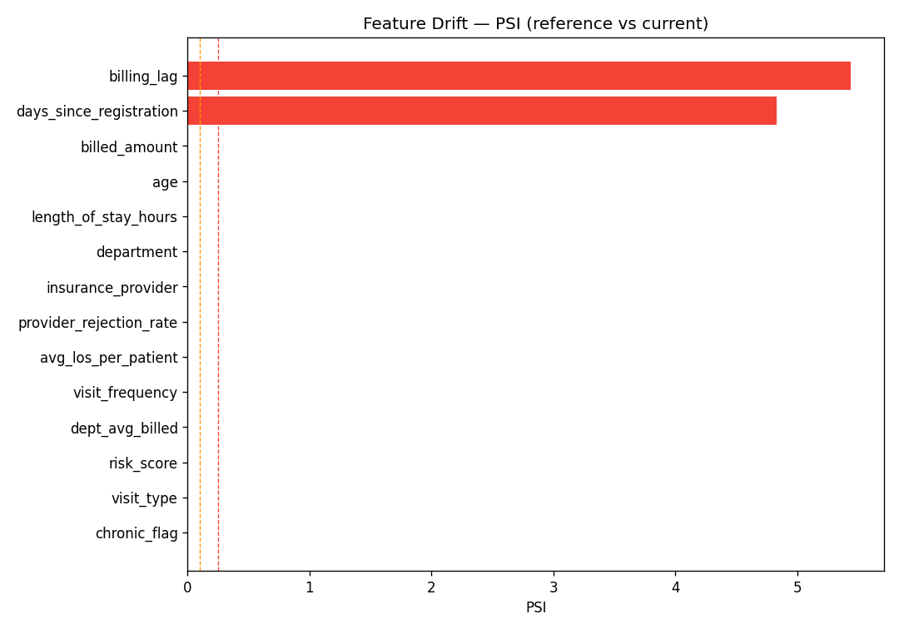
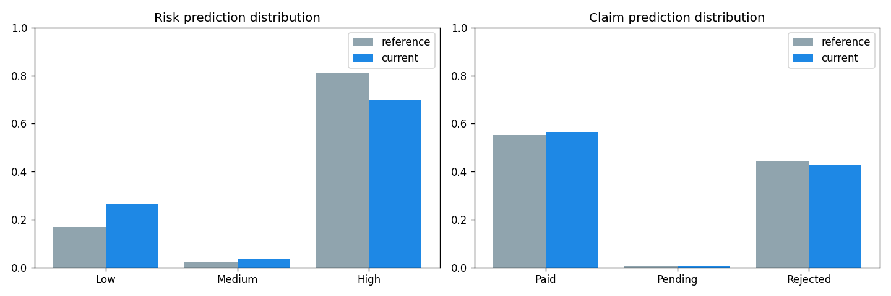

# Drift Detection Report

_Generated by `generate_drift_report.py`. Reference = earliest 80% of
history (training era); current = most recent 20% (recent operations)._

| Window | Period | Records |
|--------|--------|---------|
| Reference | 2025-01-20 → 2025-11-08 | 20,000 |
| Current | 2025-11-08 → 2026-01-20 | 5,000 |

## 1. Executive Summary

- **Data validation (current window):** ❌ FAIL — 5,000 rows, 1 issue(s).
- **Feature drift:** 3 of 14 monitored features flagged (2 with *significant* PSI ≥ 0.25).
- **Risk-prediction drift:** PSI 0.0691 (stable), chi² p=2.374e-66 → ⚠️ drift.
- **Claim-prediction drift:** PSI 0.0036 (stable), chi² p=0.0002438 → ⚠️ drift.

> **PSI bands:** &lt;0.1 stable · 0.1–0.25 moderate · ≥0.25 significant.

## 2. Data Validation — Current Window

FAIL — 5000 rows, 1 issue(s):
  [range] billing_lag: 4491 value(s) outside [0, 365] (count=4491)

## 3. Feature Drift

| Feature | Type | PSI | Band | Test | p-value | Drifted |
|---------|------|-----|------|------|---------|---------|
| `billing_lag` | numeric | 5.4403 | significant | ks | 0 | ⚠️ yes |
| `days_since_registration` | numeric | 4.8326 | significant | ks | 0 | ⚠️ yes |
| `billed_amount` | numeric | 0.0030 | stable | ks | 0.02967 | ⚠️ yes |
| `age` | numeric | 0.0021 | stable | ks | 0.2547 | no |
| `length_of_stay_hours` | numeric | 0.0021 | stable | ks | 0.362 | no |
| `department` | categorical | 0.0020 | stable | chi2 | 0.1669 | no |
| `insurance_provider` | categorical | 0.0016 | stable | chi2 | 0.09511 | no |
| `provider_rejection_rate` | numeric | 0.0013 | stable | ks | 0.1878 | no |
| `avg_los_per_patient` | numeric | 0.0010 | stable | ks | 0.8842 | no |
| `visit_frequency` | numeric | 0.0004 | stable | ks | 1 | no |
| `dept_avg_billed` | numeric | 0.0003 | stable | ks | 0.4846 | no |
| `risk_score` | categorical | 0.0001 | stable | chi2 | 0.8073 | no |
| `visit_type` | categorical | 0.0000 | stable | chi2 | 0.989 | no |
| `chronic_flag` | numeric | 0.0000 | stable | ks | 0.9323 | no |

## 4. Prediction Drift

**Risk model** (reference→current share): Low: 16.8%→26.7% | Medium: 2.2%→3.5% | High: 81.0%→69.8%
- PSI 0.0691 (stable) · chi² p=2.374e-66

**Claim model** (reference→current share): Paid: 55.3%→56.4% | Pending: 0.4%→0.8% | Rejected: 44.3%→42.9%
- PSI 0.0036 (stable) · chi² p=0.0002438

## 5. Recommended Actions

| Condition | Action |
|-----------|--------|
| Any feature PSI ≥ 0.25 | Investigate upstream source; confirm it is a real population shift, not a pipeline bug. |
| Prediction PSI ≥ 0.25 | Pull recent ground-truth labels; recompute live precision/recall against Phase 4 targets. |
| Validation FAIL | Quarantine offending records; do **not** auto-serve until the feed is corrected. |
| Sustained drift across 2+ cycles | Trigger the retraining workflow (see GOVERNANCE.md §Retraining). |

_See [GOVERNANCE.md](../GOVERNANCE.md) for thresholds, ownership, and the retraining policy._
